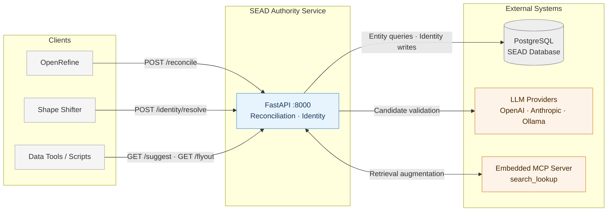
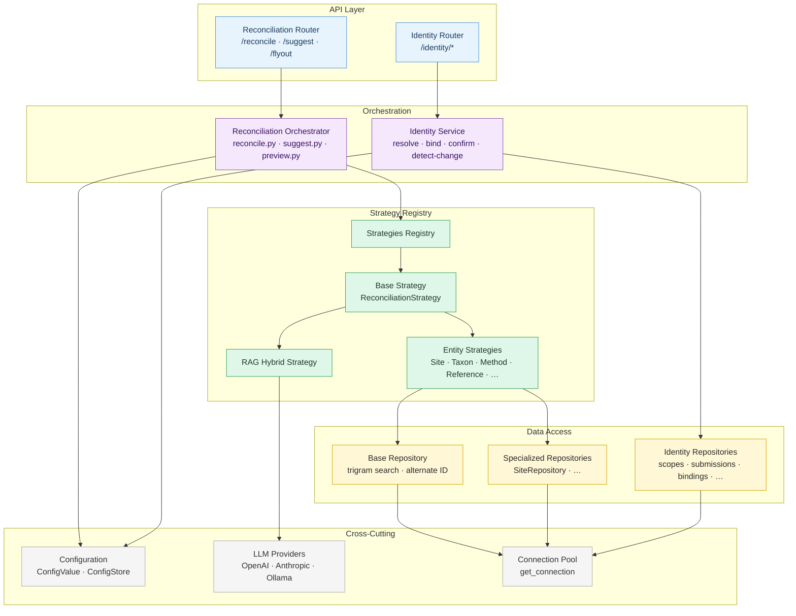
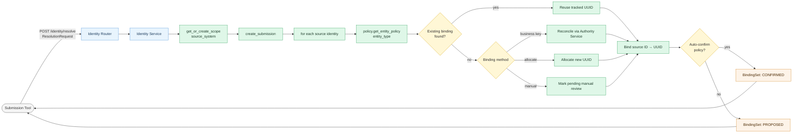
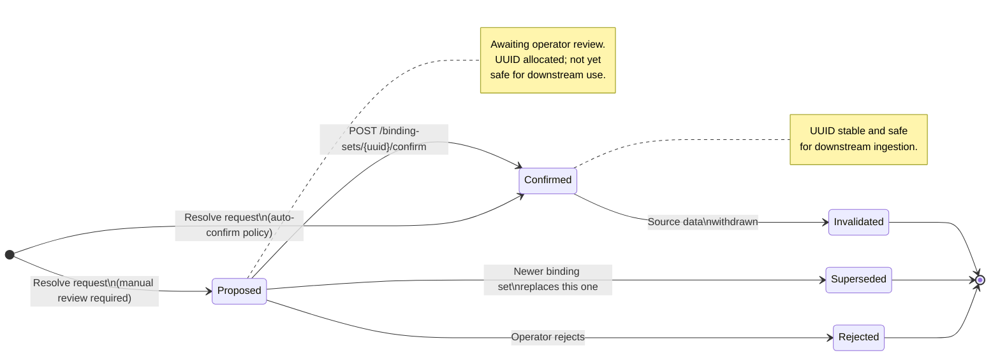
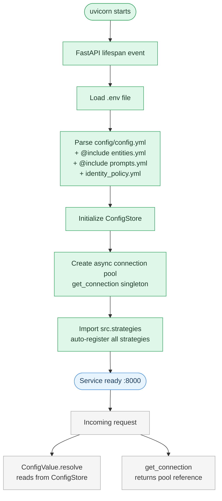

# SEAD Authority Service - System Diagrams

Diagrams describing the system's context, component structure, runtime flows, and state machines.

---

## 1. System Context

External systems that interact with the SEAD Authority Service and the direction of each integration.



---

## 2. Component Architecture

Internal components of the service and their relationships.



---

## 3. Reconciliation Request Flow

How a reconciliation query travels from an external client through the service to a response.

```mermaid
flowchart LR
    C([Client]) -->|POST /reconcile| RR[Reconciliation Router]

    RR -->|Validate request| ORC[Orchestrator]

    ORC -->|for each query| STR{Strategies.get\nentity_type}

    STR -->|strategy found| FIND[find_candidates]
    STR -->|not found| ERR[Return empty result]

    FIND --> PROPS[Parse property hints\nlat · lon · DOI · etc.]
    PROPS --> ALT{Alternate ID\nmatch?}

    ALT -->|yes| EXACT[Exact lookup\nby alt identifier]
    ALT -->|no| TRGM[Trigram search\nPostgreSQL]

    EXACT --> SCORE[Score and rank candidates]
    TRGM --> SCORE

    SCORE --> RAG{RAG hybrid\nenabled?}

    RAG -->|yes| LLM[LLM validation\nof top candidates]
    RAG -->|no| FMT[Format as OpenRefine candidates]
    LLM --> FMT

    FMT --> ORC
    ORC --> C

    classDef io fill:#f5f5f5,stroke:#aaaaaa,color:#333333;
    classDef decision fill:#fff7d6,stroke:#d6a300,color:#2b2b2b;
    classDef action fill:#e8f4fd,stroke:#4a90d9,color:#1a3a5c;
    classDef ext fill:#fdf3e8,stroke:#d48a2a,color:#4a2800;
    classDef err fill:#ffe0e0,stroke:#d64545,color:#4a1f1f;

    class C io;
    class STR,ALT,RAG decision;
    class RR,ORC,FIND,PROPS,EXACT,TRGM,SCORE,FMT action;
    class LLM ext;
    class ERR err;
```



---

## 4. Strategy Auto-Registration

How reconciliation strategies enter the registry at startup.

```mermaid
flowchart LR
    BOOT[Application startup] --> IMPORT[main.py imports\nsrc.strategies]

    IMPORT --> WALK[strategies/__init__.py\nrecursive module load]

    WALK --> M1[site.py]
    WALK --> M2[taxon.py]
    WALK --> M3[method.py]
    WALK --> M4[reference.py]
    WALK --> MN[…]

    M1 -->|@Strategies.register\nkey=site| REG[(Strategies Registry)]
    M2 -->|@Strategies.register\nkey=taxon| REG
    M3 -->|@Strategies.register\nkey=method| REG
    M4 -->|@Strategies.register\nkey=bibliographic_reference| REG
    MN -->|@Strategies.register\n…| REG

    REG --> READY[Runtime: Strategies.get\nentity_type → strategy]

    classDef boot fill:#dff7e8,stroke:#2e9f5b,color:#1d3a29;
    classDef module fill:#f5f5f5,stroke:#aaaaaa,color:#333333;
    classDef registry fill:#e8f4fd,stroke:#4a90d9,color:#1a3a5c;
    classDef ready fill:#fff7d6,stroke:#d6a300,color:#2b2b2b;

    class BOOT,IMPORT,WALK boot;
    class M1,M2,M3,M4,MN module;
    class REG registry;
    class READY ready;
```

---

## 5. Identity Resolution Flow

How the SIMS identity module resolves a batch of source identities into stable UUIDs.



---

## 6. Binding Set State Machine

Lifecycle states of a SIMS `BindingSet` from creation to final outcome.



---

## 7. Tracked Identity State Machine

Lifecycle states of a `TrackedIdentity` (a stable UUID allocated to a SEAD entity).

```mermaid
stateDiagram-v2
    direction LR

    [*] --> Allocated : UUID allocated\non first resolution

    Allocated --> PendingMaterialization : Binding confirmed;\nawaiting Clearinghouse ingestion

    PendingMaterialization --> Materialized : Clearinghouse\ncommit confirmed

    Materialized --> Invalidated : Source data\nwithdrawn or superseded

    Allocated --> Invalidated : Allocation voided\nbefore materialization

    Invalidated --> [*]

    note right of Allocated
        UUID exists; not yet
        written to SEAD.
    end note

    note right of Materialized
        UUID is live in the
        SEAD Clearinghouse.
    end note

    classDef allocated fill:#fff7d6,stroke:#d6a300,color:#2b2b2b;
    classDef pending fill:#e8f4fd,stroke:#4a90d9,color:#1a3a5c;
    classDef materialized fill:#dff7e8,stroke:#2e9f5b,color:#1d3a29;
    classDef invalidated fill:#eeeeee,stroke:#888888,color:#333333;

    class Allocated allocated;
    class PendingMaterialization pending;
    class Materialized materialized;
    class Invalidated invalidated;
```



---

## 8. Configuration and Initialization Sequence

Order of initialization at service startup.



---

## Related Documents

- [DESIGN.md](DESIGN.md) — architecture rationale, component responsibilities, design decisions, and known constraints
- [DEVELOPMENT.md](DEVELOPMENT.md) — contributor workflow and development commands
- [SIMS documentation](SIMS/) — identity module requirements, design views, and entity tracking policy
