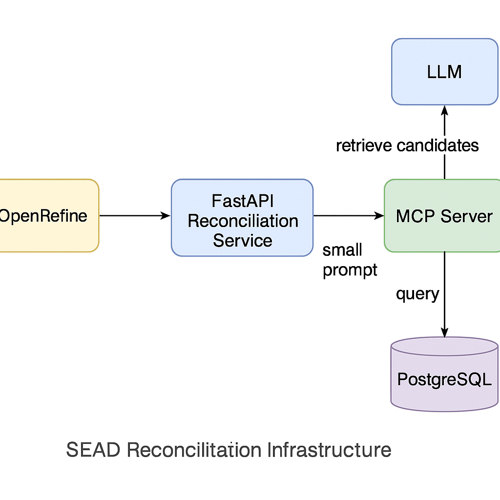

# SEAD Reconciliation via MCP — Architecture Doc (Outline)

## 1) Purpose & Scope

* **Goal:** Reconcile free-text strings to SEAD lookup tables using a tiny-prompt RAG pipeline.
* **Why MCP:** Standardized connector between FastAPI and SEAD retrieval, enabling small prompts, auditability, and modular growth.
* **Out of scope:** DB schema design, OpenRefine UI specifics, and any write/curation workflows (see Future Work).

---

## 2) High-Level Architecture

* **Clients:** OpenRefine → FastAPI `/reconcile`
* **Core services:**

  * **FastAPI app** (orchestrator; LLM caller via Ollama)
  * **SEAD MCP Server** (retrieval tools over Postgres)
  * **Postgres** (lookup tables, pg_trgm, pgvector)
  * **Ollama** (LLM + optional reranker)
* **Data flow (sequence):**

  1. OpenRefine sends `{context, queries[]}` → FastAPI
  2. FastAPI (MCP client) → `search_lookup` on MCP
  3. (Optional) MCP `rerank` → top-5
  4. FastAPI → LLM (context + top candidates) → strict JSON
  5. FastAPI → OpenRefine (preserve input order)

---

## 3) MCP API Surface (Read-only, Minimal)

**Resources**

* `lookup_tables` → list tables (name, domain, language, status)
* `lookup_rows:{table}` → paged rows (id, value, aliases?, language, active)

**Tools**

* `search_lookup(table, query, k_sem=30, k_fuzzy=30, k_final=20, language?, active_only?)`

  * **Returns:** `[ { id, value, raw_scores:{trgm, sem, blend}, meta? } ]`
* `get_by_id(table, id)` → `{ id, value, aliases?, language, active, timestamps }`
* *(Optional)* `rerank(query, candidates[], k=5)` → sorted `[ { id, value, score } ]`

---

## 4) Retrieval Logic (inside MCP)

* **Normalize:** lowercase, de-accent, trim.
* **Hybrid:** pg_trgm (fuzzy) top 30 + pgvector (semantic) top 30 → union, de-dup.
* **Blend:** simple weighted score (e.g., 0.5 trigram, 0.5 semantic).
* **Cut:** keep 15–20; optional cross-encoder rerank to top-5.
* **Filters:** language, active rows, domain tags.

---

## 5) LLM Prompting (FastAPI)

* **System prompt:** strict JSON, no invented IDs/values, max 5 candidates.
* **User prompt:** 1–2 sentence context + single input value + 5–10 `(id, value)` lines.
* **Params:** temperature 0.0; short max tokens; validate JSON post-hoc.
* **Scoring:** prefer deterministic scores (reranker/blend). Use LLM for reasons/formatting.

---

## 6) SLAs & SLOs (Targets)

* **p95 latency per input:**

  * MCP search ≤ 150 ms (same cluster)
  * Rerank ≤ 120 ms (optional)
  * LLM ≤ 400 ms (short prompt)
  * End-to-end ≤ 900 ms
* **Availability:** 99.5% monthly (MCP + FastAPI).
* **Quality metrics:** Recall@5 ≥ 0.95 (on gold set), MRR ↑ over time.

---

## 7) Security & Access Control

* **DB role:** read-only, least privilege.
* **MCP auth:** bearer token/mTLS; rotate keys; per-env secrets.
* **Allowlist:** expose only approved lookup tables.
* **Logging:** structured, per tool invocation (who/what/when).

---

## 8) Observability

* **Logs (per request):** input, top-k IDs, raw scores, final picks, confidence, LLM tokens, timings.
* **Metrics:** QPS, error rate, p50/p95 latency (MCP/LLM/overall), cache hit rate.
* **Dashboards:** service health, quality KPIs (Recall@5, nDCG), drift indicators.

---

## 9) Testing & Evaluation

* **Gold set:** 50–200 labeled pairs per domain; store versioned.
* **CI checks:** JSON validity, deterministic score mapping, latency budgets.
* **Periodic eval:** weekly Recall@k/MRR; ablate weights (trgm vs vector); update thresholds.

---

## 10) Rollout Plan

1. **Shadow mode:** FastAPI calls both (legacy vs MCP); compare logs.
2. **Tuning:** adjust blend weights, thresholds, candidate K.
3. **Cutover:** feature flag to enable MCP; keep rollback path.
4. **Post-launch:** monitor KPIs; trim costs (reduce K if stable).

---

## 11) Operations & Runbooks

* **Reindexing:** steps to recreate pg_trgm/pgvector indexes.
* **Embedding updates:** when model changes, schedule re-embed + backfill.
* **Cache policy:** TTL (e.g., 24h) for candidate sets; bust on table updates.
* **Incident playbook:** MCP timeout → fallback to local fuzzy; LLM JSON error → single retry with repair.

---

## 12) Performance Knobs (Defaults)

* Retrieval: 30 (trgm) + 30 (vector) → 15–20 union.
* Rerank: keep top-5 (optional).
* Threshold: return `[]` if best score < 0.6 (tune with gold set).
* Batching: ≤ 3 inputs per LLM call; parallelize MCP per input.

---

## 13) Future Work

* **Curation MCP (write-enabled):** add alias, retire row, attach provenance.
* **Multi-KB:** query SEAD + external ontologies, merge candidates.
* **Small LoRA:** improve JSON fidelity/reasons; keep retrieval unchanged.
* **Language packs:** per-language weights, stemming, stopwords, transliteration rules.

---

## 14) Risks & Mitigations

* **Large prompts creeping in:** enforce top-k caps in FastAPI.
* **Model drift:** record embedding model/version; schedule re-eval.
* **Latency spikes:** warm models at startup; circuit-break MCP and LLM separately.

---

## 15) Glossary

* **MCP:** Model Context Protocol, a standard for tool/data access by AI apps.
* **RAG:** Retrieval-Augmented Generation (retrieve small context, then generate).
* **pg_trgm / pgvector:** Postgres extensions for fuzzy and vector search.
* **Cross-encoder:** Re-ranker scoring (query, candidate) jointly for relevance.

---

**Owner:** HUMlab / SEAD Infra
**Contacts:** @roger.mahler
**Last updated:** *(fill on publish)*



### Great—here are **minimal, practical MCP tool specs**

You can drop into (or layer onto) an existing PostgreSQL MCP server. They’re focused on your reconciliation/RAG flow and keep the surface small but expressive.

---

# 1) Namespacing & Versioning

* **Server id:** `sead.pg`
* **Semver:** `x.y.z` (start at `0.1.0`)
* **Capabilities:** `resources`, `tools`
* **Auth:** bearer token (read-only DB role)

Expose the server version via a read-only **resource** `server_info`.

**`server_info` (resource) → object**

```json
{
  "server": "sead.pg",
  "version": "0.1.0",
  "emb_model": "nomic-embed-text@vX",
  "pgvector_dim": 768,
  "features": ["search_lookup", "rerank", "get_by_id", "lookup_tables", "lookup_rows"]
}
```

---

# 2) Core Resources (read-only)

## 2.1 `lookup_tables`

Describe available lookup domains and flags.

**Response (array of objects):**

```json
[{
  "table": "taxon",
  "domain": "taxonomy",
  "languages": ["sv", "en"],
  "active_only_default": true,
  "columns": {
    "id": "uuid",
    "value": "text",
    "norm_value": "text",
    "aliases": "text[]",
    "language": "text",
    "active": "bool",
    "emb": "vector"
  }
}]
```

## 2.2 `lookup_rows:{table}`

Paged browse for debugging/preview.

**Params:**

```json
{ "offset": 0, "limit": 50, "language": "en", "active_only": true }
```

**Response:**

```json
{
  "rows": [
    { "id": "…", "value": "Alces alces", "language": "la", "active": true }
  ],
  "next_offset": 50
}
```

---

# 3) Tools (actions)

## 3.1 `search_lookup`  ✅ (the essential one)

Hybrid retrieval over a single table; returns compact, scored candidates.

**Input**

```json
{
  "table": "taxon",
  "query": "älg",
  "k_fuzzy": 30,
  "k_sem": 30,
  "k_final": 20,
  "language": null,
  "active_only": true,
  "filters": { "domain": null }, 
  "return": { "raw_scores": true, "aliases": false, "limit": 20 }
}
```

* `k_fuzzy`, `k_sem` = per-channel tops (pg_trgm/BM25 vs pgvector).
* `k_final` = union cap before optional re-rank.
* `language` (optional) = prefer/limit candidates by language.
* `active_only` default `true`.
* `return.raw_scores` default `true`.

**Output**

```json
{
  "table": "taxon",
  "query": "älg",
  "candidates": [
    {
      "id": "…",
      "value": "Alces alces",
      "language": "la",
      "active": true,
      "raw_scores": { "trgm": 0.86, "sem": 0.91, "blend": 0.885 }
    }
  ],
  "limits": { "k_fuzzy": 30, "k_sem": 30, "k_final": 20 },
  "elapsed_ms": 47
}
```

**Notes**

* `blend` = simple weighted average (e.g., 0.5/0.5). Keep weights server-side.
* Always **de-duplicate** by `id`.
* Do **not** return large text blobs; keep payload lean.

---

## 3.2 `rerank` (optional, recommended)

Cross-encoder scoring on the small candidate set from `search_lookup`.

**Input**

```json
{
  "query": "älg",
  "candidates": [
    { "id": "…", "value": "Alces alces" },
    { "id": "…", "value": "Cervus elaphus" }
  ],
  "k": 5
}
```

**Output**

```json
{
  "query": "älg",
  "results": [
    { "id": "…", "value": "Alces alces", "score": 0.93 },
    { "id": "…", "value": "Cervus elaphus", "score": 0.41 }
  ],
  "elapsed_ms": 82,
  "model": "bge-reranker-base@onnx"
}
```

**Notes**

* Scores are **not** forced to [0,1]; you can min-max/Platt scale in FastAPI if needed.
* If you don’t host a reranker, omit this tool; clients can rely on `blend`.

---

## 3.3 `get_by_id`

Single-row fetch for preview/audit.

**Input**

```json
{ "table": "taxon", "id": "…" }
```

**Output**

```json
{
  "id": "…",
  "value": "Alces alces",
  "aliases": ["älg", "European elk"],
  "language": "la",
  "active": true,
  "provenance": { "source": "SEAD", "created_at": "2022-03-01", "updated_at": "2025-09-15" }
}
```

---

## 3.4 `normalize` (optional utility)

Expose your canonical normalization so clients can mirror server behavior.

**Input**

```json
{ "text": " Älg  ", "ops": ["deaccent","lower","trim","collapse_ws"] }
```

**Output**

```json
{ "result": "alg" }
```

---

# 4) Error Model

Uniform, small set—map to MCP error envelope.

```json
{
  "error": {
    "code": "BAD_REQUEST" | "UNAUTHORIZED" | "FORBIDDEN" | "NOT_FOUND" |
            "UNSUPPORTED_TABLE" | "INVALID_PARAM" | "SERVER_ERROR" | "TIMEOUT",
    "message": "human-friendly message",
    "details": { "hint": "optional details" }
  }
}
```

Examples:

* `UNSUPPORTED_TABLE` when `table` not in `lookup_tables`.
* `INVALID_PARAM` when `k_final < 1` or `k_final > 100`.
* `TIMEOUT` if DB or model call exceeds server budget.

---

# 5) Limits & Defaults (sane starting points)

* `k_fuzzy` **30**, `k_sem` **30**, `k_final` **20**
* `rerank.k` **5**
* `active_only` **true**
* Max `limit` in responses **50**
* Hard server timeout per tool **300 ms** (search), **150 ms** (rerank) — tune to your infra.

---

# 6) Security & Governance

* DB **read-only** role, schema allow-list for exposed tables.
* Per-tool **rate limits** (e.g., 50 req/s per token).
* Structured logs: `{tool, table, query_hash, k, elapsed_ms, row_count}`.
* Include `server_info.version` in every response header/metadata for traceability.

---

# 7) Client (FastAPI) Usage Pattern

1. Call `search_lookup` with `{table, query, language?, active_only?}`.
2. (Optional) Call `rerank` on returned candidates; keep top-5.
3. Send **only those 5–10** `(id, value)` to your LLM prompt.
4. Validate JSON; map/clip scores to `[0,1]` if required by OpenRefine.
5. If top score < threshold (e.g., 0.6) → return `[]`.

---

# 8) Interop & Backward Compatibility

* Add a `schema_version` field to every tool output:

```json
{ "schema_version": "0.1", "…": "…" }
```

* When changing fields, bump minor; when breaking, bump major and keep old tools around (e.g., `search_lookup_v1`, `search_lookup_v2`) for a deprecation window.

---

# 9) Minimal Conformance Tests (no code, just checks)

* **Happy path:** `search_lookup` returns ≤ `k_final` items, non-empty, sorted by `blend`.
* **Filters:** `active_only=true` never returns inactive rows.
* **Language pref:** when set, top results’ `language` matches or is boosted.
* **Rerank stability:** reranked top-1 belongs to original candidate set.
* **Latency budgets:** 95th percentile under targets.
* **Error cases:** invalid table, invalid k, unauthorized.

---

# 10) What you’ll likely extend later

* Add `properties` / `synonym_of` relations for richer preview.
* Add per-table **domain weights** (e.g., trigram 0.6 vs vector 0.4).
* Add `suggest_aliases` (offline curation aid) and `preview` shapes for UI.

---

This is intentionally lean: one **must-have tool** (`search_lookup`), one **nice-to-have** (`rerank`), and two **supporting** endpoints. Implement these and your FastAPI can consume MCP cleanly while keeping prompts tiny and responses deterministic.
Awesome—here’s a **practical, detailed stack** that fits your FastAPI + MCP + SEAD RAG setup. It’s opinionated but swappable; I’ve called out safe defaults and when to upgrade.

# Core Application

## FastAPI (orchestrator, LLM caller)

* **Runtime:** Python 3.11–3.12
* **Framework:** FastAPI + Uvicorn (workers via `gunicorn` or `uvicorn --workers N`)
* **Key libs:**

  * `pydantic>=2` (models), `orjson` (fast JSON), `httpx` (async HTTP), `tenacity` (retries)
  * DB client: `psycopg[binary]` (sync) or `asyncpg` (async)
  * Validation: `jsonschema` or `pydantic` validators for strict JSON output
  * Auth: `python-jose` (JWT) or `authlib` (OAuth2) if you front with an IdP
* **Caching:** Redis 7 (candidate-set memoization; 24h TTL; key = table|normalized_query|params)
* **Config/secrets:** `pydantic-settings` + environment variables; secrets via Vault/1Password/SOPS

## MCP Client (inside FastAPI)

* **SDK:** Official MCP client (Node or Python). If Python client isn’t mature in your stack, a thin HTTP client to your MCP Server (below) is fine.
* **Transport:** HTTP/JSON or stdio (HTTP is easier to observe/rate-limit)

---

# Retrieval & Storage

## PostgreSQL

* **Version:** PostgreSQL **16+**
* **Extensions:**

  * `pg_trgm` (fuzzy), `pgvector` (semantic)
* **Schema basics (per lookup table):**

  * `id` (UUID or bigint), `value` (TEXT), `norm_value` (TEXT), `aliases` (TEXT[] optional), `language` (TEXT), `active` (BOOLEAN), `emb` (VECTOR(dim))
* **Indexes:**

  * `GIN (norm_value gin_trgm_ops)`
  * `ivfflat` on `emb` (choose `lists` based on rows: ~1 per 1–2k rows to start)
* **Storage:** NVMe SSD; start with 50–200 GB depending on snapshot policy
* **Tuning (safe starters):**

  * `shared_buffers = 25% RAM`, `work_mem = 64–128MB`, `maintenance_work_mem = 1–2GB`
  * `effective_cache_size = 70% RAM`, `random_page_cost = 1.1` on NVMe
  * Autovacuum on; partition by table if >1M rows in the future

## Embedding jobs (one-time + incremental)

* **Job runner:** a small worker (Python) or **Arq**/**RQ**/**Celery**; queue stored in Redis
* **Scheduling:** systemd timer or CronJob (if on Kubernetes) for re-embeds & backfills
* **Versioning:** record `embedding_model`, `dim`, `created_at`, `updated_at` per row

---

# MCP Server (SEAD retrieval layer)

* **Language:** Node.js (LTS) **or** Python; pick what your team prefers
* **If Node:** use the **official Postgres MCP server** as a base and extend with custom tools
* **If Python:** implement minimal tools with the official SDK (or thin HTTP service)
* **Tools to expose:**

  * `search_lookup(table, query, k_sem, k_fuzzy, k_final, language?, active_only?)`
  * `rerank(query, candidates[], k)` *(optional)*
  * `get_by_id(table, id)`
  * `lookup_tables`, `lookup_rows:{table}` (paged)
* **Auth:** Bearer JWT or mTLS; **read-only DB role**
* **Rate-limit:** `X` req/s per token; circuit-breaker & timeouts (200–300 ms budget)

---

# Models & Inference

## Ollama (local inference host)

* **Runtime:** Ollama latest (GPU preferred)
* **Base LLM (generation/JSON):**

  * **Primary:** `gpt-oss:20b` (or Llama-3–8B-Instruct for speed)
  * **Context:** set `num_ctx` only as needed (8k–32k is usually plenty)
  * **Params:** temperature 0.0, top-p 0.9, top-k 50, low `max_tokens` (300–500)
* **Embedding model:**

  * `nomic-embed-text` **or** `bge-small-en` (fast) / `bge-base-en` (better)
  * If multilingual, `bge-m3` or `multilingual-e5`
* **(Optional) Cross-encoder reranker:**

  * `bge-reranker-base` or `e5-reranker` (ONNX/Torch)
  * Run on CPU if throughput is modest; use GPU if >200 QPS anticipated
* **Hardware guidance:**

  * **Dev/small prod:** 1× NVIDIA 24 GB (RTX 4090 or A5000), 16–32 vCPU, 64–128 GB RAM
  * **CPU-only:** viable for embeddings/reranker; LLM latency will be higher

---

# API & Integration

## OpenRefine

* **Endpoints:** `/reconcile` (now), `/suggest`, `/preview` (later)
* **Contract:** Strict JSON, scores in [0,1]; preserve input order
* **Thresholds:** return `[]` if best < 0.6 (tune via gold set)

## FastAPI-to-Ollama

* Prefer **local socket/host networking** for low latency
* Add **retry-on-timeout** with backoff; single retry only

## FastAPI-to-MCP

* HTTP with **short deadlines** (search ≤150 ms, rerank ≤120 ms)
* Return **raw scores** to the app; map to [0,1] centrally for consistency

---

# Ops, Security, and Observability

## Deployment

* **Containerization:** Docker images for FastAPI, MCP Server, and Ollama
* **Orchestration:** start with **Docker Compose**; move to **Kubernetes (k3s/RKE)** when scaling
* **Ingress:** NGINX or Traefik, TLS via Let’s Encrypt
* **Secrets:** HashiCorp Vault or Kubernetes Secrets sealed with SOPS
* **Backups:** `pg_dump` nightly + weekly base backup (WAL archiving if large)

## Monitoring & Logs

* **Metrics:** Prometheus + Grafana (dashboards for DB, MCP, FastAPI, Ollama)
* **Tracing:** OpenTelemetry (FastAPI → MCP → DB; sample at 10–20%)
* **Logs:** Loki + Promtail (structured JSON logs)
* **Alerts:** Alertmanager (p95 latency, error rate, DB bloat, GPU memory)

## Security

* **DB role:** read-only with schema allow-list
* **Network:** mTLS between services where feasible; least-privilege firewall rules
* **Auth:** per-environment tokens; rotate keys; short TTLs
* **Compliance:** request/response logging with hashing of queries; PII scrubber if necessary

---

# Performance Targets (starting SLOs)

* **End-to-end per input (p95):** ≤ 900 ms

  * MCP search ≤ 150 ms
  * Rerank ≤ 120 ms (if enabled)
  * LLM finalize ≤ 400 ms
* **Quality:** Recall@5 ≥ 0.95 on a 100–200 example gold set; MRR tracked weekly
* **Cost/latency knobs:** K values (30/30→20), reranker on/off, LLM size, caching TTL

---

# DevEx & CI/CD

* **Repo layout:** mono-repo with services `/fastapi`, `/mcp-server`, `/infra`
* **CI:** GitHub Actions — lint (ruff), type-check (mypy), unit tests (pytest), image builds
* **CD:** tag-based deploy to staging/prod with Helm or Compose
* **Data fixtures:** a tiny synthetic lookup table + golden tests for reconciliation

---

# Safe Defaults to Start

* Postgres 16 + `pg_trgm`, `pgvector`
* Redis 7 for cache/queue
* FastAPI (Py 3.11), `psycopg`, `orjson`, `httpx`
* Ollama: Llama-3-8B-Instruct for speed; `nomic-embed-text` embeddings
* (Optional) CPU reranker `bge-reranker-base`
* Docker Compose on a single GPU host; Prometheus/Grafana/Loki stack
* Threshold 0.6; retrieve 30/30 → 15–20; rerank to top-5; LLM only formats + reasons

---
