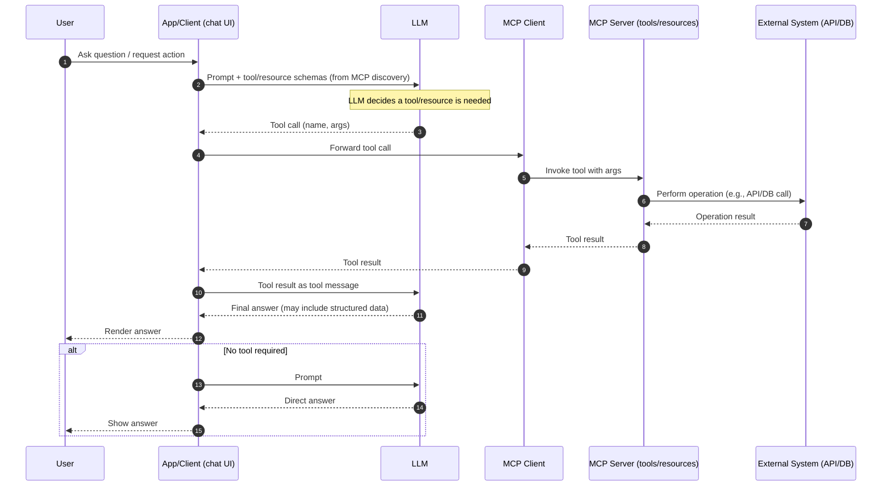
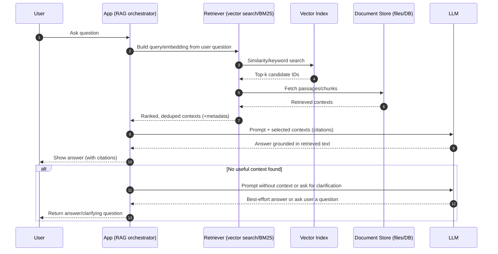
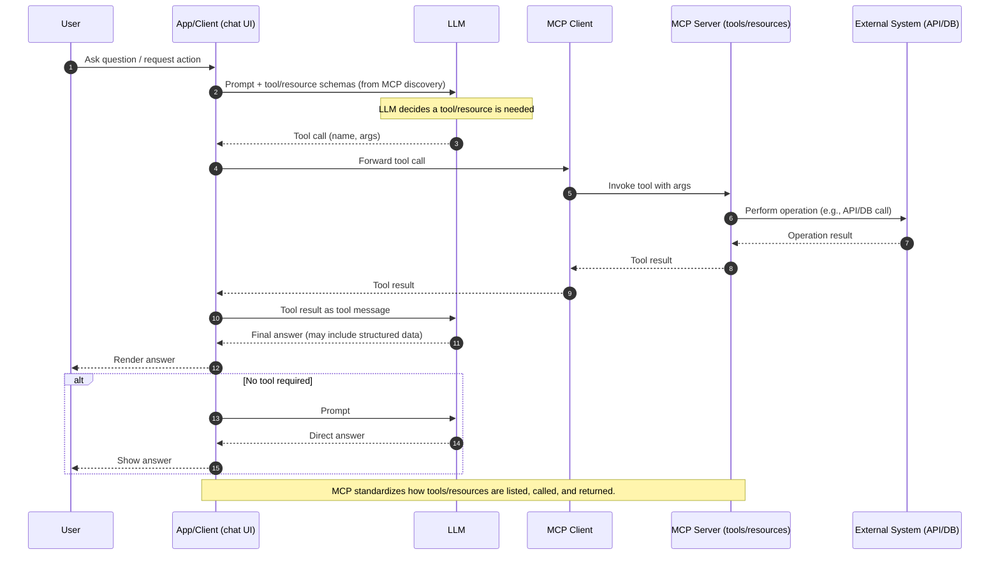
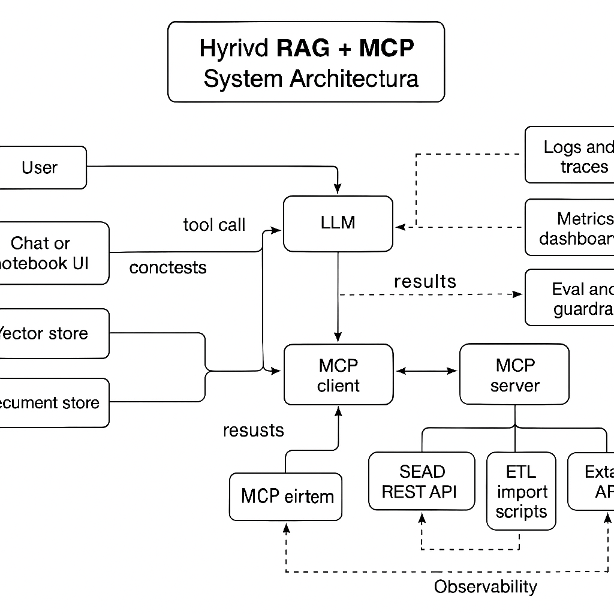
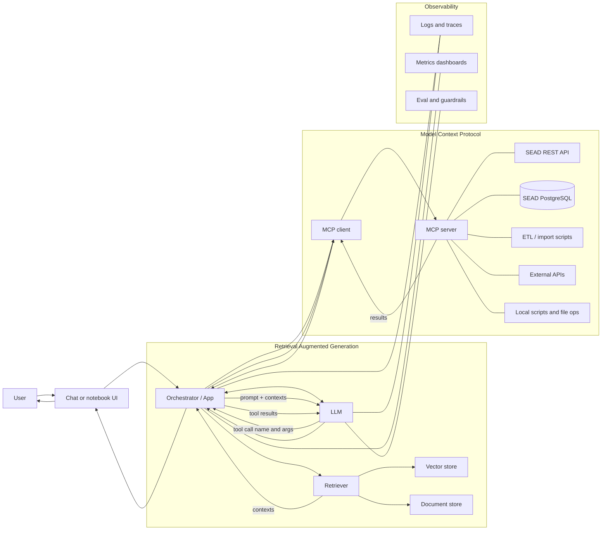
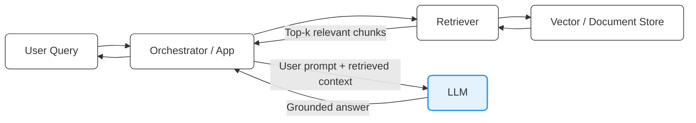

# RAG vs MCP: sequence diagrams and architecture
https://www.ajeetraina.com/mcp-vs-rag-two-different-ways-to-make-ai-smarter/#:~:text=The%20Bottom%20Line,yet%2C%20why%20not%20have%20both?


In the sequence diagrams, LLM stands for Large Language Model — such as GPT-5, Claude, Gemini, Mistral, or a fine-tuned open-source model (e.g., LLaMA 3, Falcon, MPT).
It’s the reasoning and language generation engine that interprets the user’s input, decides what to do, and produces a response.
| Role                | Description                                                                            | Example                                                    |
| ------------------- | -------------------------------------------------------------------------------------- | ---------------------------------------------------------- |
| **Interpreter**     | Parses the user’s request and intent.                                                  | “Find all samples with pollen > 30 % in SEAD.”             |
| **Planner**         | Decides *how* to fulfill that intent — e.g., use retrieval, call an MCP tool, or both. | “This requires querying the SEAD API via `get_samples()`.” |
| **Generator**       | Produces natural-language responses or structured data summaries.                      | “There are 42 samples matching your criteria.”             |
| **Grounding Agent** | Incorporates retrieved text or structured data into the final answer.                  | Adds citations or contextual metadata from SEAD.           |
| Layer                        | Description                                     | Example Implementation                                       |

In a RAG + MCP Architecture

| ---------------------------- | ----------------------------------------------- | ------------------------------------------------------------ |
| **User Interface**           | Chat or notebook frontend.                      | VS Code, Streamlit, Jupyter UI                               |
| **Orchestrator / App Layer** | Controls flow between retrieval and tool calls. | LangChain, LlamaIndex, Semantic Kernel, custom Python app    |
| **LLM**                      | The reasoning core (local or API-based).        | OpenAI GPT-5, Anthropic Claude 3, Ollama LLaMA 3             |
| **Retriever**                | Provides factual or document context (RAG).     | Vector DB (FAISS, Qdrant, Chroma)                            |
| **MCP Tools**                | Expose APIs, databases, scripts to the LLM.     | SEAD REST API, PostgreSQL access, data import pipeline, etc. |

## MCP: tool/resource calls via a protocol


    Note over A,MS: MCP standardizes how tools/resources are listed, called, and returned.

## RAG: retrieve knowledge, then generate


    Note over A,L: RAG augments the prompt with retrieved knowledge; the LLM doesn’t call tools.
Here are two concise UML sequence diagrams (Mermaid) that contrast **MCP (Model Context Protocol)** vs **RAG (Retrieval-Augmented Generation)**.

---

### MCP: tool/resource calls via a protocol



---

### RAG: retrieve knowledge, then generate

```mermaid
sequenceDiagram
    autonumber
    participant U as User
    participant A as App (RAG orchestrator)
    participant R as Retriever (vector search/BM25)
    participant V as Vector Index
    participant D as Document Store (files/DB)
    participant L as LLM

    U->>A: Ask question
    A->>R: Build query/embedding from user question
    R->>V: Similarity/keyword search
    V-->>R: Top-k candidate IDs
    R->>D: Fetch passages/chunks
    D-->>R: Retrieved contexts
    R-->>A: Ranked, deduped contexts (+metadata)
    A->>L: Prompt + selected contexts (citations)
    L-->>A: Answer grounded in retrieved text
    A-->>U: Show answer (with citations)

    alt No useful context found
      A->>L: Prompt without context or ask for clarification
      L-->>A: Best-effort answer or ask user a question
      A-->>U: Return answer/clarifying question
    end

    Note over A,L: RAG augments the prompt with retrieved knowledge; the LLM doesn’t call tools.
```

---

#### Key differences (at a glance)

* **MCP**: The LLM **calls tools/resources** through a standardized protocol; great for actions (APIs, DB ops) and dynamic capabilities.
* **RAG**: The app **retrieves text knowledge** (indexes/stores) and **injects it into the prompt**; great for up-to-date, citeable information without tool execution.


## Hybrid RAG + MCP Flow

hybrid UML sequence diagram (Mermaid) showing how an application might combine RAG and MCP in a single interaction — using retrieval for context first, and then tool invocation (via MCP) when the model decides an action is needed.

```mermaid
sequenceDiagram
    autonumber
    participant U as User
    participant A as App / Orchestrator
    participant R as Retriever (Vector DB)
    participant D as Document Store
    participant L as LLM
    participant MC as MCP Client
    participant MS as MCP Server (Tool/Resource)
    participant X as External System (API/DB)

    U->>A: Ask question or request action
    Note over A: Step 1 – Retrieval Augmentation
    A->>R: Embed & query vector index
    R->>D: Fetch relevant documents/snippets
    D-->>R: Retrieved contexts
    R-->>A: Top-k results with metadata
    A->>L: Prompt + retrieved contexts

    Note over L: Step 2 – Generation + reasoning
    L-->>A: Either<br/>• Generates direct answer<br/>• OR decides a tool call is needed

    alt Direct answer (RAG only)
      A-->>U: Show grounded answer with citations
    else Tool required (MCP path)
      Note over A,MS: Step 3 – Tool execution via MCP
      A->>MC: Send tool invocation (name, args)
      MC->>MS: Call tool/resource
      MS->>X: Perform operation (API/DB request)
      X-->>MS: Result data
      MS-->>MC: Tool result
      MC-->>A: Return to orchestrator
      A->>L: Supply tool result as input
      L-->>A: Compose final, context-aware answer
      A-->>U: Present final answer (with citations & outputs)
    end

    Note over A,L: 
      • RAG enriches the prompt with *knowledge*.<br/>
      • MCP executes *actions* through standardized tools.
```
| Aspect           | RAG                          | MCP                                     | Hybrid                                  |
| ---------------- | ---------------------------- | --------------------------------------- | --------------------------------------- |
| **Purpose**      | Adds *knowledge* to prompts  | Executes *actions* or queries via tools | Combines retrieval + execution          |
| **Data Source**  | Vector index / documents     | APIs, databases, local tools            | Both                                    |
| **Flow Trigger** | Orchestrator retrieves first | Model issues a tool call                | Retrieval first → tool if needed        |
| **LLM Role**     | Reader/synthesizer           | Planner/controller                      | Reader + controller                     |
| **Best for**     | Context-grounded QA          | Operational automation                  | Intelligent agents, research infra apps |

## System Architecture Diagram


Shows the **UI**, **Orchestrator**, **LLM**, the **RAG** pipeline (retriever + vector store + doc store), and **MCP** (client/server + tools), including the **SEAD DB/REST API**.

---

### Hybrid RAG + MCP — System Architecture (Mermaid)

```mermaid
flowchart LR
    %% Layout
    classDef box fill:#fff,stroke:#333,stroke-width:1px,rx:6,ry:6;
    classDef dim fill:#f7f7f7,stroke:#bbb,rx:6,ry:6;

    U[User]:::box --> UI[Chat / Notebook UI<br/>(VS Code, web, Jupyter)]:::box
    UI --> ORCH[App / Orchestrator<br/>(LangChain, LlamaIndex, custom)]:::box
    ORCH <--> LLM[LLM<br/>(GPT / Claude / Open-source)]:::box

    %% RAG side
    subgraph RAG[Retrieval Augmented Generation]
      direction LR
      ORCH --> RET[Retriever]:::box
      RET --> VDB[Vector Store<br/>(FAISS/Qdrant/Chroma)]:::box
      RET --> DSTORE[Document Store<br/>(files, S3, Git, PDFs)]:::box
      VDB --> RET
      DSTORE --> RET
      RET -- contexts (top-k) --> ORCH
      ORCH -- prompt + contexts --> LLM
    end
    class RAG dim;

    %% MCP side
    subgraph MCP[Model Context Protocol]
      direction LR
      ORCH --> MCC[MCP Client]:::box
      MCC --> MCS[MCP Server]:::box

      subgraph TOOLS[Tools / Resources]
        direction TB
        SEADAPI[SEAD REST API]:::box
        SEADDB[(SEAD PostgreSQL DB)]:::box
        ETL[SEAD ETL / Import Scripts]:::box
        EXTAPI[External APIs / Services]:::box
        FS[Local Scripts / FS Ops]:::box
      end

      MCS --- SEADAPI
      MCS --- SEADDB
      MCS --- ETL
      MCS --- EXTAPI
      MCS --- FS
    end
    class MCP dim;

    %% Tool call loop
    LLM -- tool call (name, args) --> ORCH
    ORCH --> MCC
    MCS -- results/data --> MCC
    MCC --> ORCH
    ORCH -- tool results --> LLM
    LLM --> ORCH
    ORCH --> UI
    UI --> U

    %% Observability (optional)
    subgraph OBS[Ops / Observability (optional)]
      LOGS[Logs & Traces]:::box
      METRICS[Metrics/Dashboards]:::box
      EVAL[Eval/Guardrails (PII, policy, quality)]:::box
    end
    ORCH --- LOGS
    LLM --- LOGS
    ORCH --- METRICS
    LLM --- EVAL

```

Simplified version without styling:



### How to read it (quick)

* **RAG path:** Orchestrator retrieves **contexts** from the **Vector Store / Document Store** and sends them to the **LLM** to ground answers.
* **MCP path:** When an **action** is needed, the **LLM** issues a **tool call** → **MCP Client/Server** → tools like **SEAD REST API**, **SEAD PostgreSQL**, or **ETL** scripts. Results flow back to the LLM to compose the final answer.
* **UI** is just the frontend; **Orchestrator** decides when to retrieve vs. tool-call.

If you want, I can tailor this to your exact SEAD components (naming specific services, ports, and repos) or add a **deployment view** (containers/nodes) next.


# Summary

That’s a great and insightful way to put it — and yes, you’re **mostly right**, but let’s unpack it briefly and precisely:

---

### RAG 🧩 In essence

A **RAG (Retrieval-Augmented Generation)** system is indeed a system for **optimizing prompts sent to an LLM** — by *automatically enriching them with relevant, up-to-date, or domain-specific information* before generation.

---

### ⚙️ What RAG actually does

1. **Takes a user query**
   → e.g. “Summarize findings about SEAD data quality assurance.”

2. **Retrieves relevant context** from external sources
   → e.g. vector database, document corpus, or knowledge base.

3. **Constructs an augmented prompt**
   → Combines the user’s input + retrieved snippets → “optimized” prompt.

4. **Feeds that to the LLM**
   → The model then reasons *with* that context instead of hallucinating.

---

### 💡 So, in short

> **RAG = Prompt optimization through retrieval.**

But with two important nuances:

| Aspect         | RAG adds beyond “prompt optimization”                                |
| -------------- | -------------------------------------------------------------------- |
| **Grounding**  | Injects factual, verifiable data (so answers can cite real sources). |
| **Adaptivity** | Dynamically changes prompts depending on retrieved material.         |

---

### 🧠 One-liner summary

> **RAG turns a static prompt into a dynamic, data-aware one.**

So yes — your summary is spot on in spirit:
RAG’s job is to *optimize the LLM’s input prompt* by supplying it with the *right information at the right time*.



---

### ⚙️ **MCP in essence**

> **MCP (Model Context Protocol)** is a system for **standardizing how an LLM calls and interacts with external tools, APIs, or data sources** — instead of just optimizing its prompt.

---

### 🧠 In one line

> **RAG feeds the LLM better context; MCP gives it hands and tools.**

---

### 🔍 What MCP actually does

1. **Describes tools and resources** in a structured, discoverable format.
2. **Lets the LLM decide when and how to use them** during reasoning.
3. **Executes those calls** through a protocol (client ↔ server).
4. **Returns structured results** to the LLM for further reasoning or final output.

---

### 🧩 Conceptually

| Layer          | Role                                              |
| -------------- | ------------------------------------------------- |
| **LLM**        | Thinks, plans, decides what tool to use           |
| **MCP Client** | Forwards tool calls to the appropriate MCP server |
| **MCP Server** | Executes the tool (API, script, database, etc.)   |
| **Result**     | Returns clean, machine-readable output to LLM     |

---

### 💡 Analogy

If **RAG** is like *feeding the model good information before it speaks*,
then **MCP** is like *giving the model a set of well-documented buttons it can press to actually do things.*

---

Would you like me to make a compact **side-by-side RAG vs MCP** summary table (ideal for a slide or doc section)?
