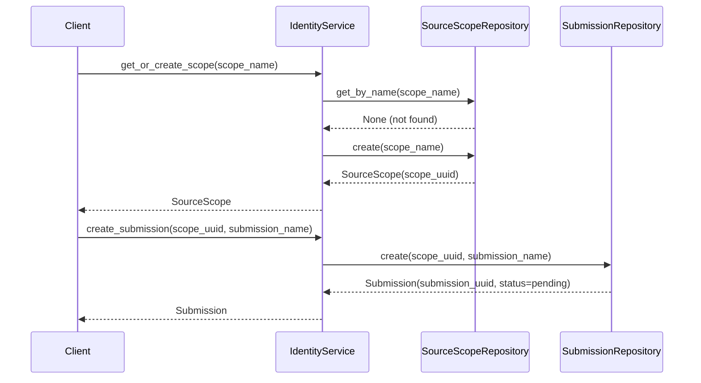
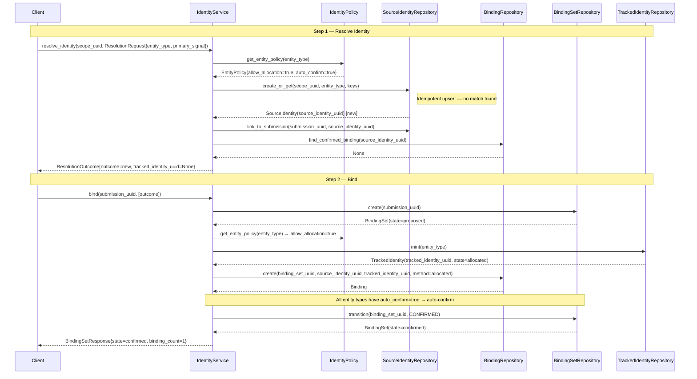
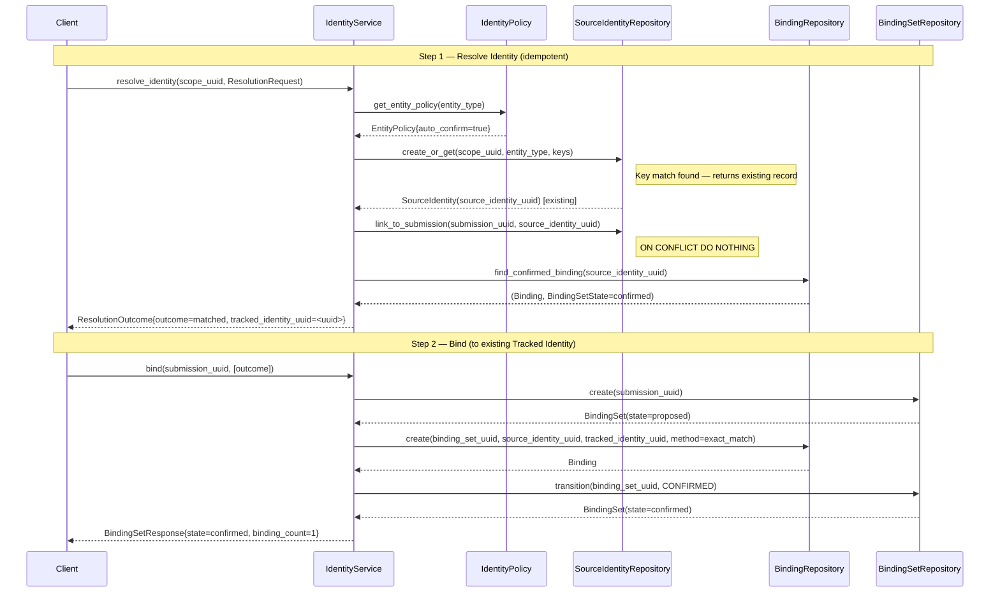
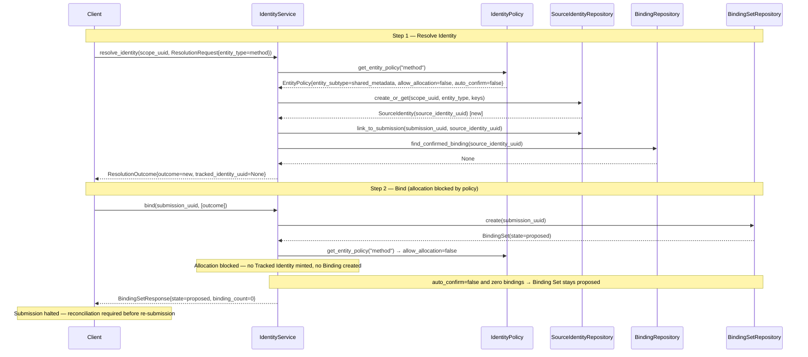
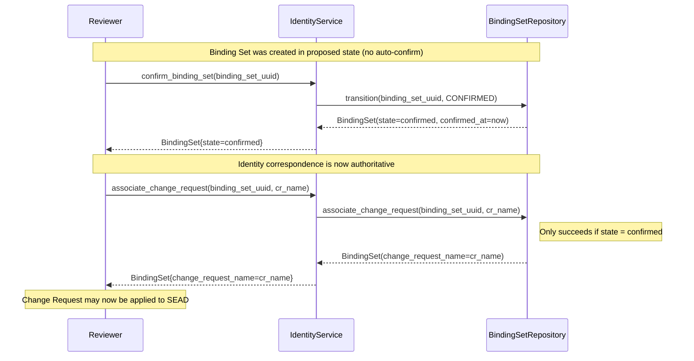
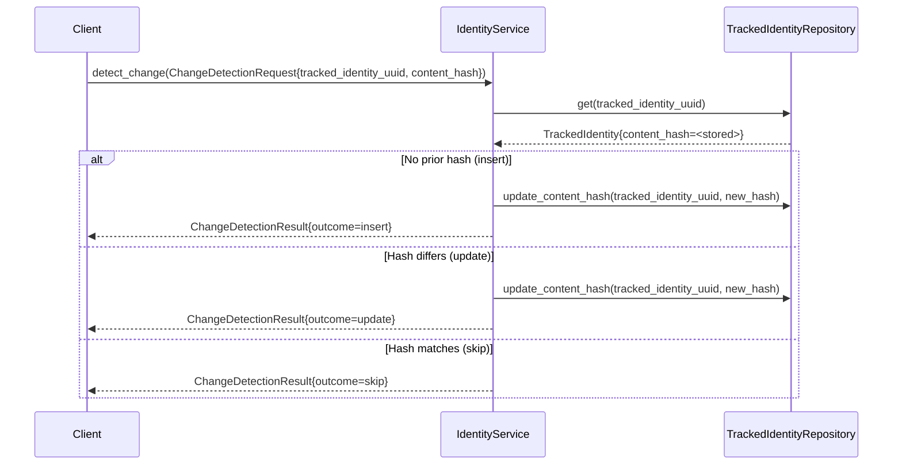

# SIMS Sequence Diagrams

Sequence diagrams covering the core SIMS workflows. See [DESIGN_VIEW.md](./DESIGN_VIEW.md) for the decision flow and [IMPLEMENTATION_VIEW.md](./IMPLEMENTATION_VIEW.md) for structural details.

---

## 1. Submission Setup

Establishes the Source Scope and Submission before any identity resolution begins. This is typically called once per ingest event.

---

## 2. Provider-Owned Entity — First Submission (New Identity)

A provider-owned entity (e.g. `site`) arrives with no prior record in SIMS. The system mints a new Tracked Identity and auto-confirms the Binding Set because the entity policy permits allocation and auto-confirmation.

---

## 3. Provider-Owned Entity — Re-Submission (Matched Identity)

The same entity arrives in a later submission. The Source Identity is found via idempotent upsert, an existing confirmed Binding is located, and the Binding Set is auto-confirmed without minting a new Tracked Identity.

---

## 4. Shared Metadata Entity — Allocation Blocked

A shared metadata entity (e.g. `method`) arrives with no prior SIMS record and no reconciliation match. Policy blocks allocation; the Binding Set is left in `proposed` state with zero Bindings, signalling that the submission cannot proceed.

---

## 5. Manual Confirmation and Change Request Association

For shared metadata entities or low-confidence matches the Binding Set requires manual review before it can be associated with a Change Request in the SEAD Change Control System.

---

## 6. Change Detection

Used to determine whether a previously materialized entity's content has changed, enabling optimistic skip-on-no-change behaviour (FR-24).

